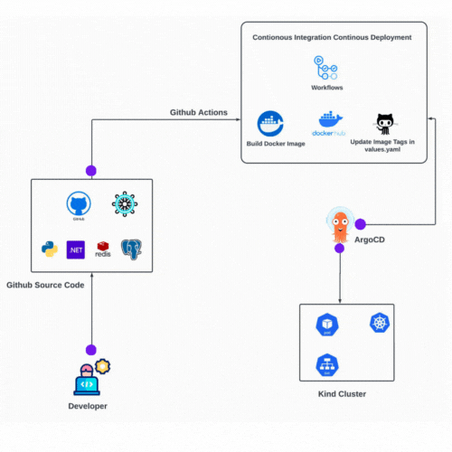

# K8s Kind Voting App

This guide provides a detailed walkthrough for setting up and managing a Kubernetes cluster using Kind (Kubernetes in Docker) on an AWS EC2 instance, along with automating application deployment through Argo CD and GitHub Actions. The guide covers everything from infrastructure setup to continuous deployment, allowing for efficient management and scaling of microservices.


## Architecture




* A front-end web app in [Python](/vote) which lets you vote between two options
* A [Redis](https://hub.docker.com/_/redis/) which collects new votes
* A [.NET](/worker/) worker which consumes votes and stores them in database
* A [Postgres](https://hub.docker.com/_/postgres/) database backed by a Docker volume
* A [Node.js](/result) web app which shows the results of the voting in real time

## Overview

This guide covers the steps to:
- Launch an AWS EC2 instance.
- Install Docker and Kind.
- Create a Kubernetes cluster using Kind.
- Install and access kubectl.
- Setting up and configuring Argo CD for continuous deployment.
- Configuring Helm charts for each microservice to manage application deployments.
- Setting up GitHub Actions workflows for CI/CD automation.
- Build and Push the Docker images to Dockerhub through pipeline.
- Automatically updating the Helm values.yaml file with the latest Docker image. 
- Using Argo CD to detect and deploy the latest image version to the Kubernetes cluster.
- Set up the Kubernetes Dashboard.
- Connect and manage your Kubernetes cluster with Argo CD.

## Step-by-Step Commands Installation

This guide provides the complete steps to set up and deploy the Vote App using a Kubernetes cluster created with Kind, along with continuous deployment using Argo CD with Helm charts

(1) Kind Cluster Setup
To set up a Kind Kubernetes cluster, follow the instructions in the Kind Cluster Setup Guide. [Kind Cluster Setup Guide](kind-cluster/commands.md).

(2) Argo CD Setup
For setting up Argo CD for continuous deployment, refer to the Argo CD Setup Guide. [Argo CD Setup Guide](gitops/argocd/install.md).

(3) Helm-Chart Setup
For deploying the Vote App using Helm, configure the required Helm chart templates and values. [Helm Chart Setup Guide](helm-commands/helm.md).

(4) Kubernetes Setup using kubectl
To manage your Kubernetes cluster and deploy applications using kubectl, check out the [Kubernetes Cluster Setup Guide](k8s-commands/k8s-commands.md).

(5) Kubernetes Dashboard Setup
To set up the Kubernetes Dashboard for monitoring and managing your cluster
[Kubernetes Dashboard Setup Guide](kubernetes-dashboard/dashboard.md).

## Github Action Pipeline Workflows Folder structure

* To create the workflows for each microservices mainly three cicd are required i.e results,vote and worker, check out the [Github workflow](.github/workflows/).


## Creating the helm charts

To create the chart run the following command:

```bash
helm create vote-app-charts 
 ```

* To list all the charts for microservices for voting-app:
[Helm Charts](k8s-specifications/helm/vote-app-charts/).


The main files are needed here are only:

- templates folder : These directory contains all the Kubernetes resource definitions that Helm uses to deploy the application. These are the raw Kubernetes manifests (such as Deployments, Services, ConfigMaps, Ingress, etc.), but with templating enabled. This folder is crucial for defining how the application should be deployed in the Kubernetes cluster.

- Chart.yaml : This file provides metadata about the Helm chart, including its name, version, description, and optional dependencies. It acts as the central configuration file for Helm to understand what this chart is and how it should behave.

- values.yaml: The values.yaml file contains default configuration values for the Helm chart. You can customize this file to provide specific values for the various templates defined in the templates/ folder, such as image names, replica counts, service types, and resource limits. Customizing values.yaml allows you to modify the behavior of the chart without editing the templates directly.

